# HTR Polygon Annotation Tool (Yat) - Руководство пользователя

HTR Polygon Annotation Tool (Yat) — это веб-приложение для подготовки и аннотирования данных для распознавания рукописного текста (HTR/OCR). Приложение позволяет выполнять полный цикл подготовки данных: от кадрирования оригинальных сканов до точной сегментации текстовых строк и ввода текста.

## Содержание

0. [Вход в систему](#вход-в-систему)
1. [Создание проекта](#создание-проекта)
2. [Загрузка изображений](#загрузка-изображений)
3. [Кадрирование (Cropper)](#кадрирование-cropper)
4. [Сегментация (Editor)](#сегментация-editor)
5. [Распознавание текста (Text Editor)](#распознавание-текста-text-editor)
6. [Пакетная обработка](#пакетная-обработка)
7. [Импорт и экспорт](#импорт-и-экспорт)
8. [Формат хранения данных](#формат-хранения-данных)
9. [Горячие клавиши](#горячие-клавиши)

---

## Вход в систему

Если на сервере установлена защита паролем:
1. При входе на сайт введите пароль
2. После успешного ввода откроется доступ ко всем проектам
3. Сессия сохраняется до закрытия браузера
4. Для выхода нажмите кнопку **«Выйти»** на главной странице

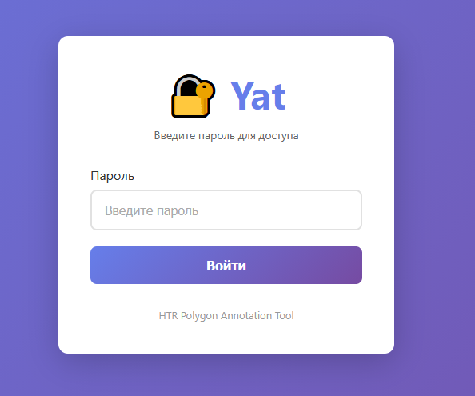

## Создание проекта

Проект - папка с изображениями. 
Например: Проект - "Китайский дневник". 
Проект можно использовать для хранения документов по темам. 

1. На главной странице нажмите **«+ Создать проект»**
2. Введите название и описание проекта
3. Нажмите **«Создать»**

Проект появится в списке на главной странице.

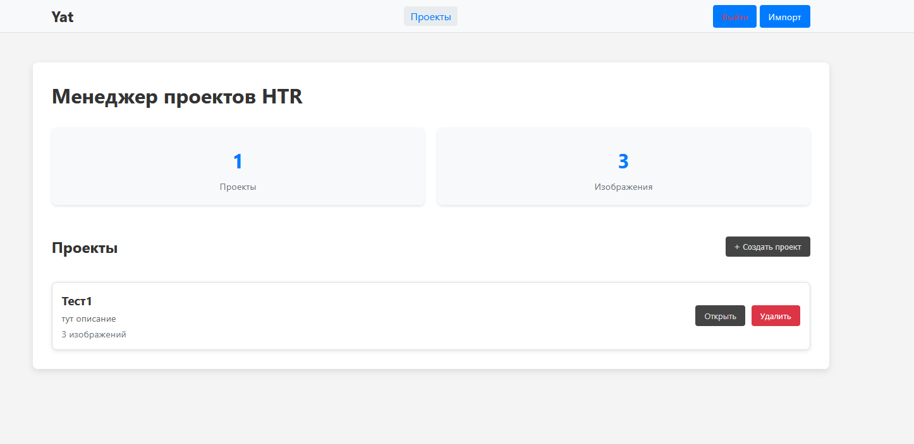

---

## Загрузка изображений

Перед работой нужно добавить обрабатываемые изображения в проект.

1. На странице проекта нажмите **«Загрузить изображения»**
2. Перетащите изображения в область **«Перетащите изображения сюда или нажмите для выбора»**
3. Или нажмите на область и выберите файлы (JPG, PNG)

Изображения появятся в списке со статусом **«Нужно кадрировать»**.

---

## Статусы изображений

Каждое изображение имеет статус, который показывает этап обработки.

### Автоматические статусы

| Статус | Описание | Когда устанавливается |
|--------|----------|----------------------|
| Нужно кадрировать | Изображение загружено, требует обрезки | После загрузки |
| Кадрировано | Изображение обрезано | После сохранения в Cropper |
| Размечено | Нанесены полигоны вокруг строк | После сохранения в Editor |
| Текст добавлен | Полигоны + текст введён | После сохранения в Text Editor |

### Ручные статусы (ревью)

| Статус | Описание |
|--------|----------|
| На ревью | Ожидает проверки |
| Проверено | Подтверждено ревьюером |

### Как изменить статус

1. Откройте страницу проекта
2. Кликните на статус изображения (например, «Размечено»)
3. В выпадающем меню выберите нужный статус
4. При необходимости добавьте комментарий
5. Нажмите **«Сохранить»** или **Enter**

**Горячие клавиши в меню статусов:**
- **Enter** — сохранить статус
- **Ctrl+Enter** — перенос строки в комментарии

### Цветовая индикация

- **Нужно кадрировать** — жёлтый
- **Кадрировано** — серый
- **Размечено** — зелёный
- **Текст добавлен** — голубой
- **На ревью** — оранжевый
- **Проверено** — фиолетовый

---

## Редакторы

В системе используется три редактора для изображений. 

1. Обрезка (кадрирование) - удаление лишних частей изображения. 
2. Сегментация - обводка строк текста на листе. 
3. Распознавание текста - построчный ввод текста. 

Все редакторы имеют похожий вид. 
Например, перетаскивание холста во всех редакторах выполняется на правую кнопку мыши. 
А переключаться между изображениями можно используя стрелочки в верхней панели. 

Попасть в каждый редактор можно по кнопкам у карточки изображения. 

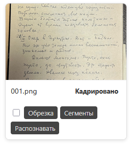

---

## Кадрирование

Первый шаг обработки — обрезать всё лишнее с картинки. Например, у нас фото тетради — в этом случае нужно обрезать всё вокруг тетрадного листа, чтобы на фото остался только сам лист.

> Кадрирование — это процесс выбора границ, ракурса и формата изображения при съемке или постобработке для улучшения композиции, удаления лишних элементов и смещения фокуса. 

После обрезки статус изображения изменится на **«Кадрировано»**.

Оригиналы (изображения до обрезки) сохраняются в `data/originals/`, поэтому можно перекадрировать изображение в любой момент.

Если для кадрируемого изображения уже были размечены области и текст в этих областях - система попытается автоматически переместить области в новое место, чтобы они остались на своих местах. Но этот алгоритм может работать с ошибками, поэтому желательно выполнять кадрирование самым первым этапом. 

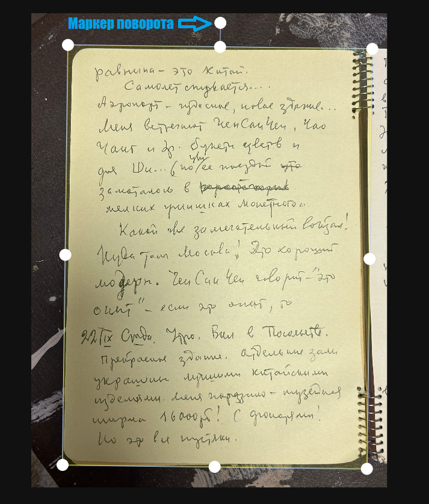

Основное содержимое страницы нужно разместить внутри желтого прямоугольника. Прямоугольник перемещается при помощи левой кнопки мыши. Размер и поворот прямоугольника можно изменять при помощи перетягивания белых маркеров. Верхний белый маркер отвечает за поворот. 

Для применения обрезки нужно нажать кнопку сохранить. После сохранения обрезки, в следующих редакторах будет использоваться обрезанная версия. 
По нажатию на кнопку сохранить, будет открыто следующее изображение. 

Из редактора обрезки можно перейти в редактор сегментов нажав "Сегменты" в верхней левой части экрана. Тогда откроется это же изображение в редакторе сегментов. 
Также можно перейти в редактор текста по кнопке "Распознавать". 

---

## Сегментация

Разметка текста полигонами - обводка каждой строки текста рамкой. 

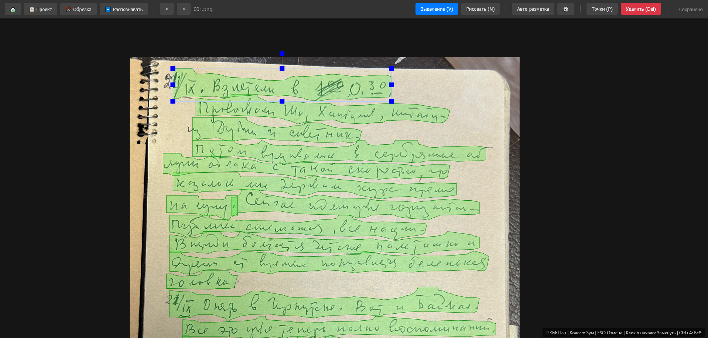

1. На странице проекта нажмите кнопку **«Сегменты»** у изображения.
2. Нажмите **«Рисовать (N)»** (в верхней панели, справа) или клавишу **N** для включения режима рисования. 
3. Кликните по изображению для создания полигона вокруг строки текста.
4. Нажмите **«Выделение (V)»** или клавишу **V** для режима выделения
5. В режиме выделения можно выбрать контур или несколько контуров. При выделении можно их перетаскивать и менять размер. 
6. При выделении одной области станет доступна кнопка "Точки (P)". По нажатии на эту кнопку можно перетаскивать отдельные вершины контура. 
7. Также при выдлении одного или нескольких полигонов станет доступна кнопка их удаления. 

Автосохранение работает автоматически при изменении полигонов.
Статус сохранения находится в верхней панели справа. 

Есть поддержка автоматического выделения сегментов по кнопке "Авто-разметка" в верхней панели. В этом случае применяется модель ИИ для поиска сегментов. 

Автоматическую разметку можно настраивать. 
Порог уверенности - при снижении модель будет замечать больше областей, но возможно будет находить строки текста там, где их нет. 
Упрощение полигонов - насколько сглаживать полигоны. 

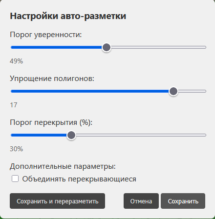

Упрощение полигонов = 0
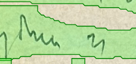

Упрощение полигонов = 20
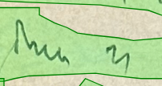

---

## Распознавание текста

Финальная часть разметки - ввод текста. 

В этом режиме изображение отображается с двух сторон. 
Слева - оригинальное изображение с наложенными сегментами. 
Справа - изображение на которое будет накладываться текст, для удобного чтения. 

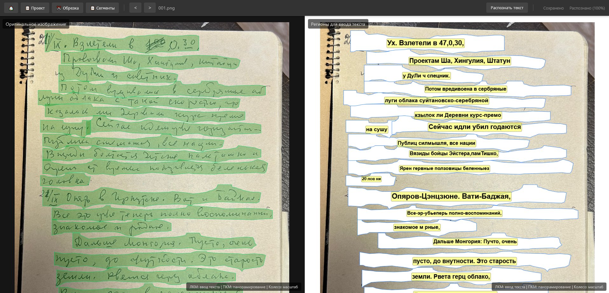

Для ввода текста нужно кликнуть на строку (сегмент). Тогда этот сегмент откроется на весь экран. 

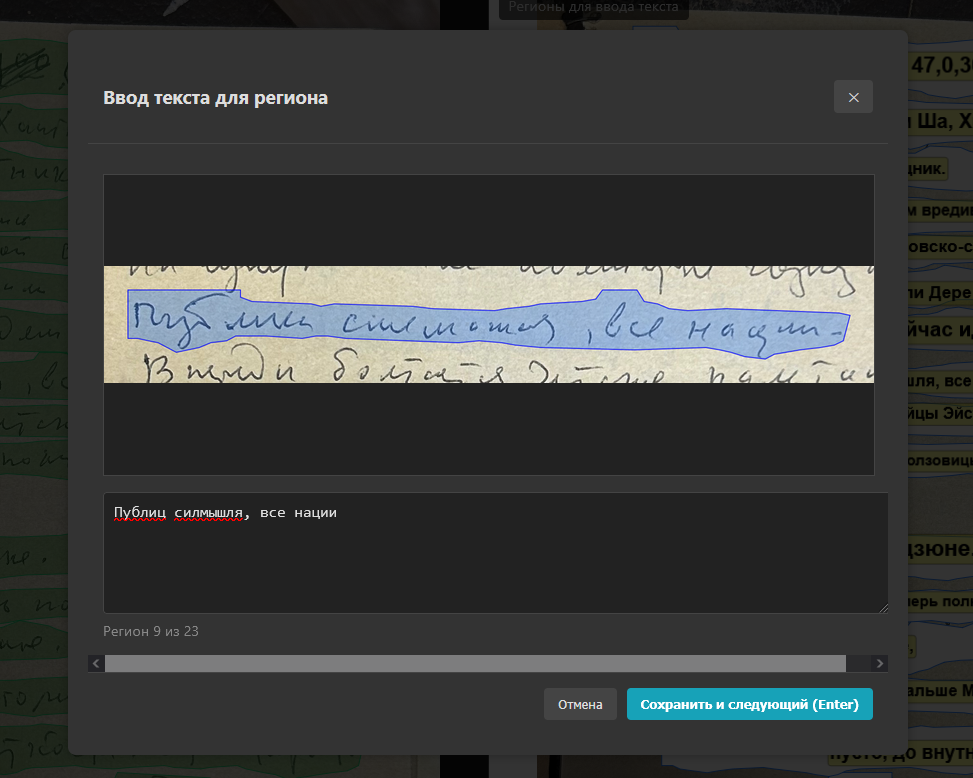

В этом режиме также возможно использовать автоматическое распознавание через модели ИИ. В будущей версии планируется улучшение качества распознавания. 

### Режим блокнота

Режим блокнота - альтернативный способ ввода текста в редакторе. Вместо работы с одним сегментом на весь экран, все строки отображаются списком. 
Для перехода в режим блокнота нажмите кнопку "блокнот" в правой части верхней панели. 

Правый холст будет заменен на список строк. Каждая строка соответствует своему сегменту. 

Данный режим особенно полезен для переноса размеченного ранее текста, для привязки его к сегментам:
1. Скопируйте текст всей страницы и вставьте его в первую сторку
2. Поставьте курсор на гранцу где заканчивается текст текущего сегмента и начинается второй
3. Нажмите **Enter** - текст после курсора перейдет на следующую строку
    **Backspace** для возврата на прошлую строку
    **Ctrl+z** - отменить последнее действие
4. Повторяйте для каждой строки: поставьте курсор на границу сегмента, нажмите **Enter**

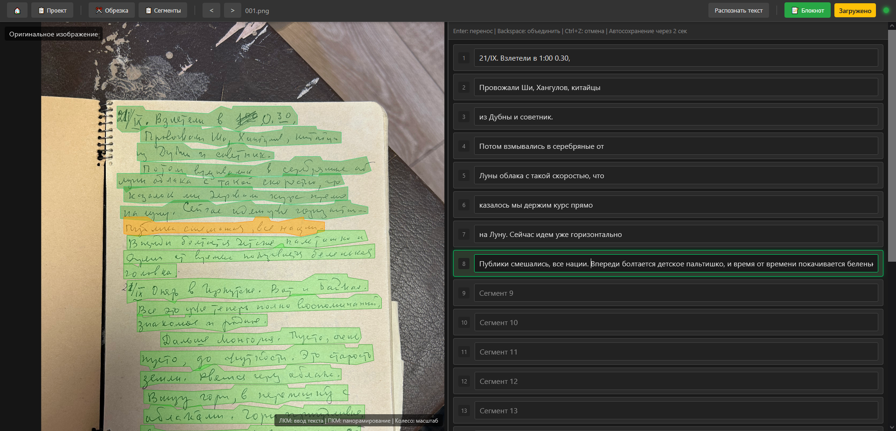

---

## Пакетная обработка

В разделе **«Пакетная обработка»** на странице проекта доступны две операции для автоматической обработки изображений в проекте.

Доступны команды:
1. Обнаружить сегменты
2. Распознать текст

Для пакетного обнаружения полигонов вокруг текстовых строк, нужно нажать на странице проекта «запустить детекцию полигонов». 
Будут обработаны изображения без полигонов. Изображения, у которых уже есть полигоны, будут пропущены. 

Аналогично для пакетного распознавания текста. Будут обработаны только изображения, где есть сегменты но нет текста. 

---

## Импорт и экспорт

### Формат данных

Есть возможность загружать и выгружать прогресс работы в виде ZIP-архивов. 
Приложение использует формат PAGE XML для хранения разметки. Этот формат совместим с eScriptorium и другими инструментами для аннотации документов.

### Импорт ZIP с главной страницы

1. На главной странице нажмите **«Импорт»**
2. Выберите ZIP-архив
3. Укажите коэффициент упрощения полигонов (например, 5)
4. Нажмите **«Импортировать»**

Будет создан новый проект с загруженными изображениями и аннотациями.

### Импорт ZIP внутри проекта

На станице проекта нажмите **«Импорт»**
2. Выберите ZIP-архив
3. Укажите коэффициент упрощения полигонов (например, 5)
4. Нажмите **«Импортировать»**

Отличие от прошлого способа: 
В этом случае **не будет** создан новый проект. Изображения и разметка добавятся в открытый проект. 

### Экспорт ZIP

1. Откройте страницу проекта
2. В верхней панели нажмите **«Экспорт»**
3. Браузер загрузит архив с именем `<project_name>_export.zip`

**Содержимое архива:**
- Изображения в корне архива
- XML-файлы аннотаций в формате PAGE XML
- Файл `project.json` с метаданными проекта

Рекомендуется периодически выполнять экспорт проекта, чтобы сохранить прогресс работы у себя на компьютере. Например, после проведенной работы. 